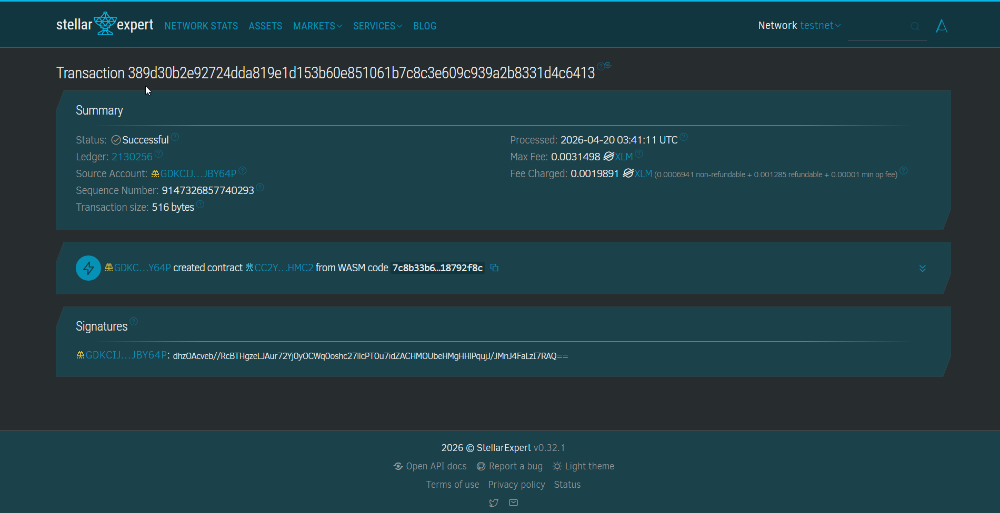

# GajiChain 💸

**GajiChain** - Blockchain-Based Decentralized Payroll Protection for Informal Workers

[](https://opensource.org/licenses/MIT)
[](https://stellar.org)
[](https://soroban.stellar.org)
[]()

---

## Project Description

GajiChain is a decentralized payroll protection system built on the Stellar blockchain using Soroban SDK. It provides a secure, trustless platform for managing salary escrow and wage disbursement directly on the blockchain. The contract ensures that worker wages are always protected and released fairly, eliminating reliance on employer goodwill or centralized payroll intermediaries.

The system allows employers to deposit wages into escrow, workers to submit verifiable work logs, and automates salary release — while also supporting earned wage advances and a dispute resolution mechanism. Each payroll entry is uniquely identified and stored within the contract's instance storage, ensuring data persistence, transparency, and on-chain auditability.

## Project Vision

Our vision is to eliminate wage theft and financial exclusion for informal workers by:

- **Decentralizing Payroll**: Moving salary management from employer-controlled systems to a trustless, global blockchain
- **Ensuring Worker Protection**: Guaranteeing that wages are locked in escrow before any work period begins
- **Guaranteeing Immutability**: Providing a tamper-proof record of payroll agreements that neither party can unilaterally alter
- **Enhancing Financial Identity**: Creating verifiable on-chain employment records that workers can use to access credit and banking services
- **Building Trustless Labor Markets**: Creating a platform where wage disputes are resolved by code and community, not by power imbalances

We envision a future where a construction worker in Bekasi has the same payroll protection as a software engineer anywhere in the world.

## Key Features

### 1. **Escrow Payroll Creation**

- Employer deposits full salary into a smart contract escrow before the work period begins
- Funds are locked and cannot be withdrawn by the employer unilaterally
- Automated payroll ID generation for unique tracking
- Persistent storage on the Stellar blockchain with full auditability

### 2. **Work Log Verification**

- Worker submits a cryptographic work log hash (GPS + timestamp + QR data) for each pay period
- Log is anchored on-chain before any payment is released
- Prevents payment release without verified proof of work
- Immutable record of work completion on the blockchain

### 3. **Automated Payment Release**

- Escrowed salary is released to the worker after work log submission
- Net payout automatically deducts any prior salary advances
- No employer approval required — release is enforced by contract logic
- Immediate settlement via Stellar's high-speed network

### 4. **Dispute Resolution**

- Employer can open a formal dispute before the payment release window
- Employer must stake tokens as a dispute bond — forfeited if the dispute is invalid
- Payroll is frozen in Disputed status during the review period
- Unique dispute ID generated for tracking and transparency

### 5. **Earned Wage Access (Salary Advance)**

- Worker can withdraw up to 80% of escrowed salary as an early advance
- Advance is automatically recovered from the final payout at release
- Zero-interest access to earned wages — no loan sharks needed
- Protects workers from emergencies between pay cycles

### 6. **Stellar Network Integration**

- Leverages the high speed and near-zero transaction fees of Stellar
- Built using the modern Soroban Smart Contract SDK
- USDC and native XLM supported as settlement tokens
- Interoperable with other Stellar-based financial services

## Contract Details

- Contract Address: CC2YQLT2ETNBMX5AVIDOI7EWOWIF5T6QYZNEVIWVUSNR3KCDRX4FHMC2



### Core Functions

| Function | Parameters | Description |
|---|---|---|
| `create_payroll()` | `employer, worker, amount, token, schedule, period_start` | Employer locks salary into escrow |
| `submit_work_log()` | `payroll_id, worker, log_hash, relayer_sig` | Worker submits verified work log |
| `release_payment()` | `payroll_id` | Releases escrowed salary to worker |
| `open_dispute()` | `payroll_id, employer, dispute_reason_hash, stake` | Employer opens a staked dispute |
| `request_advance()` | `payroll_id, worker, amount` | Worker withdraws early wage advance (≤80%) |

## Future Scope

### Short-Term Enhancements

1. **Arbiter Pool**: Add a community-based dispute resolution jury with staking rewards
2. **Multi-Token Support**: Allow payroll settlement in any Stellar-issued asset
3. **Pay Schedule Enforcement**: Auto-trigger release based on on-chain timestamp
4. **Work Log Oracle**: Native GPS/QR verification relayer integrated into the contract

### Medium-Term Development

5. **Reputation Registry**: Soulbound on-chain employment records per worker
   - Verified work history usable for bank loan applications
   - Employer ratings and reliability scores
   - Portable across DeFi lending platforms
6. **Multi-Period Payroll**: Support recurring payroll across multiple pay cycles
7. **Transaction History View**: Full audit log of all payroll events per worker
8. **Inter-Contract Integration**: Allow other Stellar contracts to query worker reputation data

### Long-Term Vision

9. **ZK Work Proofs**: Zero-knowledge proofs for selective disclosure of employment history to lenders
10. **Cross-Chain Reputation Bridge**: Port on-chain work records to Ethereum-based DeFi platforms
11. **AI Advance Risk Scoring**: Predict advance repayment risk using on-chain behavioral data
12. **Privacy Layers**: Encrypted payroll data accessible only to authorized parties
13. **DAO Governance**: Worker-governed arbitration standards and protocol upgrades
14. **DID Integration**: Link payroll records to decentralized identity (DID) systems

### Enterprise Features

15. **Multi-Location Payroll**: Support for employers with workers across multiple sites
16. **Compliance Audit Logging**: Immutable logs for Ministry of Manpower reporting
17. **BPJS Integration**: Automated contribution deductions linked to payroll release
18. **Multi-Language Support**: Bahasa Indonesia, English, and regional languages for accessibility

## Technical Requirements

- Soroban SDK
- Rust programming language
- Stellar blockchain network

## Getting Started

This project is deployed and interacted with using the **Soroban Online IDE** — no local installation required.

### 1. Open Soroban Online IDE

Go to [https://soroban.stellar.org](https://soroban.stellar.org) and open the online IDE environment.

### 2. Load the Contract

Paste or import the contract source code (`lib.rs`) into the online IDE editor.

### 3. Compile the Contract

Use the IDE's built-in **Build** tool to compile the Rust contract to WebAssembly (WASM).

### 4. Deploy to Testnet

Deploy the compiled WASM to the Stellar Testnet directly from the IDE. The deployed contract address is:

```
CASPJPI6YPLU3QS5BLAB2U6R36P24O6RR2JPD6SNM3JZGFXRVYWZWEXZ
```

### 5. Invoke Contract Functions

Use the IDE's invocation panel to call contract functions in this order:

```
# 1. Employer locks salary into escrow
create_payroll(employer, worker, amount, token, schedule, period_start)

# 2. Worker submits work log
submit_work_log(payroll_id=1, worker, log_hash, relayer_sig)

# 3. Release salary to worker
release_payment(payroll_id=1)

# Optional: Worker requests early advance (up to 80%)
request_advance(payroll_id=1, worker, amount)

# Optional: Employer opens a dispute
open_dispute(payroll_id=1, employer, dispute_reason_hash, stake)
```

### 6. Verify on Stellar Explorer

Track all transactions and contract state on the Stellar Testnet Explorer:
[https://stellar.expert/explorer/testnet](https://stellar.expert/explorer/testnet)

Search for the contract address:
```
CC2YQLT2ETNBMX5AVIDOI7EWOWIF5T6QYZNEVIWVUSNR3KCDRX4FHMC2
```

---

**GajiChain** — Securing Every Worker's Right to Be Paid
